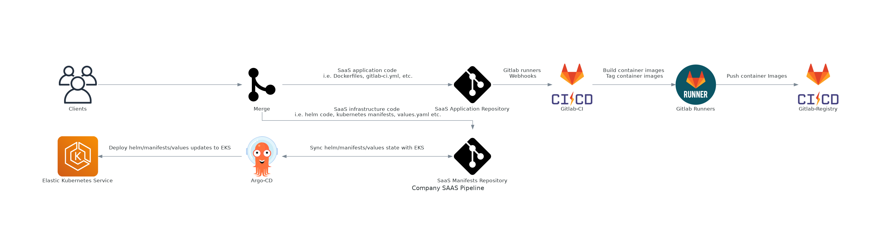
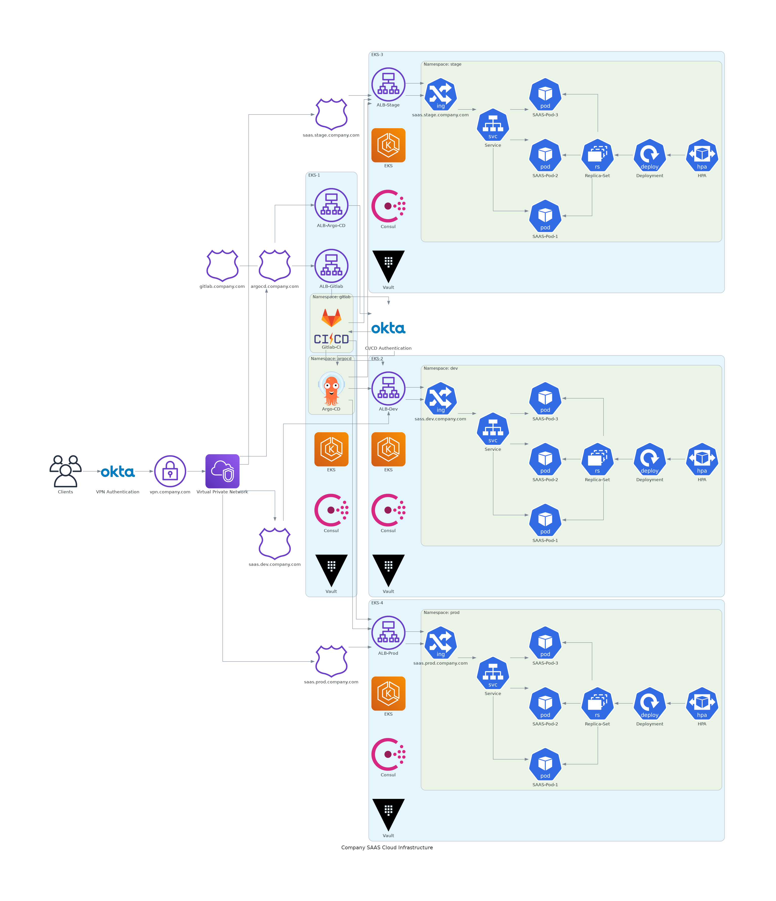

# saas-system-design
A simple exercise in pipeline release/deployment design for a xyz SaaS company.

To use this repository you will need to read through [mingrammer/diagrams](https://github.com/mingrammer/diagrams) via
[getting started](https://github.com/mingrammer/diagrams/blob/master/README.md#getting-started).

## Company SaaS Pipeline

## Company SaaS Cloud Infrastructure

## Infrastructure / Pipeline design

### Core methodology

The current state of SaaS infrastructure and release pipelines has been a primary target of technology trends inclusive to GitOps and declarative state. Desired state removes the silo between operations and development, thus removing questionable state of infrastructure, which in turn enables the developer to iterate faster.

### GitOps / Continuous Deployment

The current pipeline design proposes using Gitlab continuous integration with Gitlab runners, Argo continuous delivery, and AWS elastic kubernetes service. The benefits allow for a more stateful deployment process reducing any state drift between kubernetes and kubernetes configuration repositories. This process also enhances what security controls currently exist for continuous deployment. For example, a pull request would be required to deploy application kubernetes infrastructure to AWS EKS. The benefits shine when changes to infrastructure can be tracked via version control vs a less declarative reactive approach to searching logs for which user made what change to what system.

### Continuous Integration

[Gitlab Community Edition](https://about.gitlab.com/pricing/self-managed/feature-comparison/) offers an all-in-one approach to continuous integration. Gitlab also seems to work well hosted with Kubernetes if a more robust and highly available approach is needed. Jenkins is more focused on a "just CI" approach and offers a multitude of different plugins. Some programmers have complained about Jenkins’s automation syntax. If GitHub is the focus for version control, Jenkins might be a good fit. Using Gitlab would remove the requirement for GitHub and Jenkins. This could potentially save on costs in some areas.

### Container Orchestration

AWS EKS was selected as the application deployment environment due to the built-in high availability and services / security provided via kubernetes. An alternative option would be using the Hashicorp stack Nomad, Consul, and Vault, which has been making great traction within the cloud space. Azure AKS or Google GKE could also be used for the deployment environment. The design provides segmentation to environments dev, stage, and prod via separate kubernetes clusters and namespaces.

### AWS, Azure, and Google Cloud

Amazon web services has been around for a significant amount of time and was designed to be the leader in cloud infrastructure. With plenty of time to iterate on every bit of the cloud and work through every hurdle of customer experience, it seems AWS is at the top for a reason. AWS cost might be unreasonable for startups, but other companies like Cloudflare have been lowering that cost with competitive services like R2 storage. If current companies keep AWS costs in check then AWS will continue to be first choice for most non-Microsoft based companies.

Azure is a notable alternate to AWS. One benefit of Azure might be in the utilization of Active Directory / o365. The system design is currently utilizing Okta for identity management, which seems to make sense for a company in early growth and whose focus is toward a more cloud centric infrastructure. Azure does have user experience issues within the Azure Portal. It seems that Azure takes longer time in deployment and destruction of resources vs. AWS. Azure's UI / Portal continues to struggle, and the placement of some resources seems non-intuitive at best. Though this is simply based on personal anecdotal experience.

Google cloud seems to be the least adopted of the major three cloud services. Google cloud has a bad habit of retiring products on short notice. This could be very problematic for production environments based completely on google cloud infrastructure. Again, mostly personal anecdotal experience. Another negative is the current [market share](https://www.zdnet.com/article/the-top-cloud-providers-of-2021-aws-microsoft-azure-google-cloud-hybrid-saas/) of google cloud vs AWS and Azure.

### Closing thoughts

The system design proposes a GitOps approach for infrastructure deployment and continuous delivery. AWS seems like the most robust approach to build out the SaaS infrastructure utilizing EKS, AWS hosted zones, Load Balancers, VPCs, and VPN gateway. Gitlab or GitHub/Jenkins will be utilized for continuous integration and version control. Environments will be segmented via separate clusters and namespaces to reduce attack surface and increase fault tolerance.

The SaaS infrastructure and pipeline will allow for a highly available environment using a declarative approach. Operations engineers and development engineers will both be able to consistently be in the same methodology and practice allowing for a more seamless integration from release to deployment of all parts of the entire software and infrastructure process.

## License

[MIT](LICENSE)
